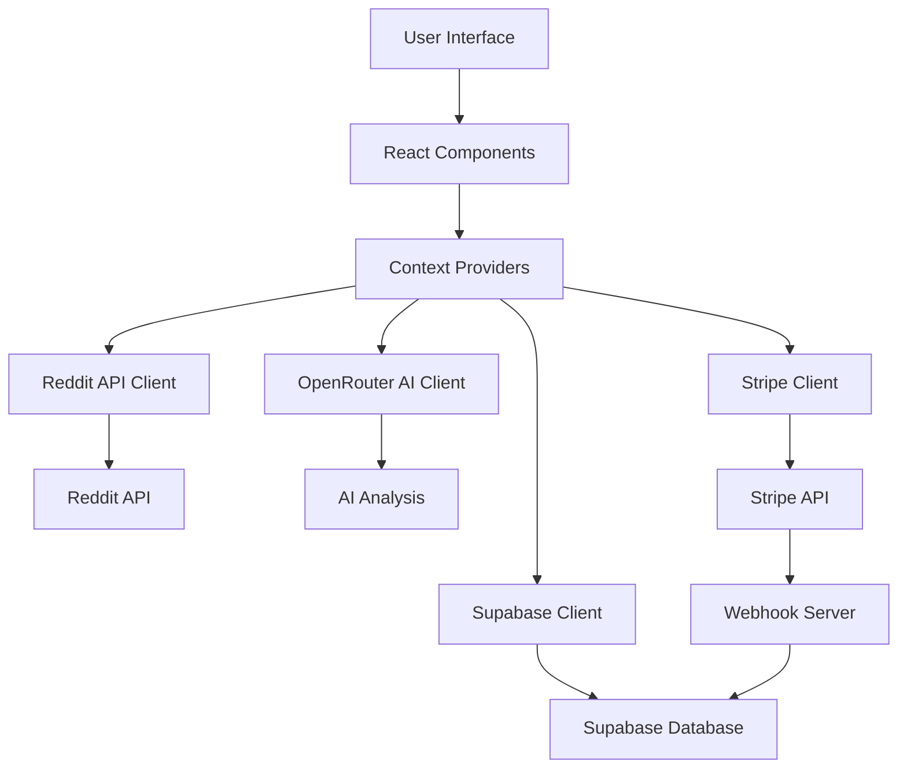
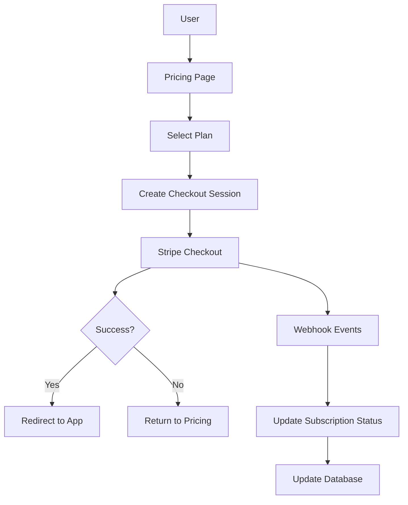
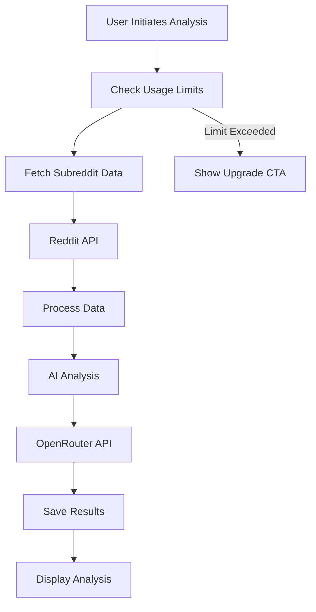

# SubPirate Documentation

## Table of Contents
1. [Overview](#overview)
2. [Architecture](#architecture)
3. [Features](#features)
4. [Technical Stack](#technical-stack)
5. [Authentication](#authentication)
6. [Database Schema](#database-schema)
7. [API Integration](#api-integration)
8. [Subscription System](#subscription-system)
9. [Webhook Processing](#webhook-processing)
10. [Components](#components)
11. [State Management](#state-management)
12. [API Routes](#api-routes)
13. [Security Features](#security-features)
14. [Usage Tracking](#usage-tracking)
15. [Deployment](#deployment)
16. [Development Guide](#development-guide)
17. [Testing Strategy](#testing-strategy)
18. [Troubleshooting](#troubleshooting)
19. [Performance Optimizations](#performance-optimizations)
20. [Future Development](#future-development)

## Overview

SubPirate is a Reddit marketing analysis tool that helps users discover, analyze, and manage marketing opportunities across different subreddits. The application provides AI-powered insights, engagement metrics, and project management features for coordinating marketing efforts across multiple subreddits.

### Key Features
- Subreddit analysis with AI-powered insights
- Project management for organizing marketing campaigns
- Team collaboration with role-based access
- Saved subreddits list for quick access
- Detailed analytics and recommendations
- Content strategy planning
- Subscription model with different tiers
- Usage tracking and limitations

## Architecture

The application follows a modern React-based architecture with the following key components:

```
src/
├── app/         # App-specific configuration and providers
├── components/  # Reusable UI components
├── contexts/    # React context providers
├── features/    # Feature-specific components and logic
│   ├── subreddit-analysis/
│   ├── project-management/
│   └── subscription/
├── hooks/       # Custom React hooks
├── lib/         # Core business logic and API integrations
│   ├── api/     # API integration
│   ├── stripe/  # Stripe integration
│   └── utils/   # Utility functions
├── pages/       # Main application pages/routes
└── workers/     # Web workers for background processing
```

### Data Flow


### Subscription Flow


### Analysis Flow


## Features

SubPirate offers a comprehensive suite of powerful features designed to enhance Reddit marketing strategies:

### Recent Improvements

#### Enhanced Reddit Account Connection Flow
The application now features an improved Reddit account connection experience:

- **Contextual Modal Display**: The "Connect a Reddit Account" modal only appears:
  - After users have completed authentication
  - After users have an active subscription
  - When users are in backend/dashboard areas (not on public pages)
  - Once per page load, respecting user dismissals

- **Technical Implementation**:
  - Path-based checks prevent modal display on public routes
  - Subscription status verification before modal display
  - Improved state management to track modal dismissals
  - Enhanced navigation tracking to reset modal state between pages
  - Better logging for visibility conditions and state changes
  - Automatic subscription bypass for test environments
  - Proper cleanup of effects to prevent memory leaks
  - Race condition prevention with mounted flags
  - Comprehensive error handling and logging

#### Stripe Integration Fixes
The application includes fixes for Stripe checkout session creation:

- **Price ID Consistency**: Updated fallback price IDs to match actual IDs in the Stripe account
- **Error Prevention**: Fixed issues causing checkout session creation failures
- **Reliable Integration**: Ensured proper price ID usage across the application
- **Technical Implementation**:
  - Updated hardcoded fallback price IDs in `SubscriptionPage.tsx`
  - Replaced placeholder IDs with actual Stripe price IDs
  - Verified proper integration with the Stripe API
  - Enhanced error handling for checkout session creation

### Subscriptions & Payments
- **Mandatory subscription requirement**: New users must select a subscription plan to access the application
- **Seamless Stripe integration**: Secure payment processing with subscription management
- **Multiple subscription tiers**: Options for different user needs
- **Checkout session creation**: Easy payment process with secure handling
- **Customer portal access**: Self-service subscription management
- **Environment detection**: Automatic test/live mode detection based on domain
- **Error recovery**: Robust handling of customer ID mismatches between environments

### Subreddit Analysis
- **Marketing friendliness score**: Analyze whether a subreddit is conducive to marketing
- **Rule analysis**: Identify exploitable gaps in subreddit rules
- **Moderator activity patterns**: Evaluate mod presence and enforcement
- **Content engagement metrics**: Understand what performs well
- **Marketing strategy recommendations**: Tailored advice for marketing approach

### SpyGlass
- **Competitor Research Tool**: Analyze any Reddit user's posting patterns and subreddit engagement.
- **Frequency Analysis**: Identifies which subreddits a user posts in most frequently with subscriber and active user counts.
- **Content Performance Metrics**: Evaluates content performance across different subreddits.
- **Historical Post Analysis**: Displays recent posts with engagement statistics.
- **One-Click Analysis**: Instantly analyze any subreddit from the frequency list.
- **Quick Saving**: Add any discovered subreddit to your saved list for future reference.
- **Project Integration**: Add interesting subreddits directly to your marketing projects.
- **Frequent Searches**: Track and quickly access your most common searches.
- **Detailed Metrics**: View subscriber counts, active users, and engagement metrics for each subreddit.
- **Real-time Data**: Fetches the most current data available from Reddit.
- **Username Parsing**: Intelligent handling of usernames with or without the "u/" prefix.
- **Rate Limit Management**: Sophisticated system to manage Reddit API rate limits for uninterrupted research.

### Saved List
- **Centralized Subreddit Collection**: Maintain a personalized list of marketing-relevant subreddits.
- **Quick Access**: Fast navigation to full analysis of any saved subreddit.
- **Custom Filtering and Sorting**: Filter by name or sort by date added or alphabetically.
- **Batch Operations**: Export data in CSV format for external analysis or integration.
- **One-Click Reanalysis**: Refresh analysis for any subreddit to get the latest insights.
- **Post Count Tracking**: Monitor the number of posts in the last 24 hours for activity trends.
- **Visual Indicators**: Content type badges and marketing score visualization for quick assessment.
- **Expandable Details**: Toggle between compact and detailed views for each subreddit.
- **Project Integration**: Add any saved subreddit to existing projects with one click.
- **Bulk Management**: Remove multiple subreddits at once or add them to projects in batch.
- **Content Type Visualization**: Color-coded badges indicate primary content types for each subreddit.
- **Post Statistics**: Quick view of recent posting activity and engagement metrics.

### Project Management
- **Marketing Campaign Organization**: Create and manage multiple marketing campaigns as separate projects.
- **Customizable Projects**: Name, describe, and add custom images to projects.
- **Subreddit Collections**: Group target subreddits into logical campaign groups.
- **Team Collaboration**: Share projects with team members with role-based permissions:
  - **Owner**: Full control including deletion and sharing
  - **Editor**: Can modify project contents and settings
  - **Reader**: View-only access for stakeholders
- **Progress Tracking**: Monitor campaign status and subreddit engagement.
- **Visual Dashboard**: See an overview of all projects with quick-access cards.
- **Project Settings**: Update project details, transfer ownership, or archive projects.
- **Activity Timeline**: Track changes and contributions from team members.
- **Subreddit Management**: Add or remove subreddits from projects as campaigns evolve.
- **Performance Metrics**: View consolidated performance data across all subreddits in a project.
- **Cross-project Analysis**: Compare performance across different campaigns.

### Analytics Dashboard
- **Comprehensive Performance Metrics**: Visual representation of Reddit marketing performance.
- **Custom Date Ranges**: Analyze data over specific time periods with flexible selection.
- **Multi-dimensional Filtering**: Filter analytics by subreddits, Reddit accounts, and projects.
- **Engagement Tracking**: Monitor upvotes, comments, and awards across all content.
- **Post Performance Analysis**: Track individual post performance with detailed metrics.
- **Content Type Effectiveness**: Analyze which content types generate the best results.
- **Interactive Charts**: Visualize data through line charts, bar charts, and pie charts using Chart.js.
- **User Growth Metrics**: Track karma and follower growth over time.
- **Trending Analysis**: Identify emerging trends and patterns in engagement.
- **Export Capabilities**: Download reports and raw data for external analysis.
- **Real-time Updates**: Refresh data on demand to see the latest statistics.
- **Performance Comparisons**: Compare performance across different time periods.
- **Insight Summaries**: AI-generated interpretations of key performance indicators.
- **User-friendly Interface**: Clean, intuitive dashboard with responsive design.

### Calendar
- **Content Schedule Visualization**: View all Reddit posts in a calendar format.
- **Multiple Views**: Toggle between month, week, and day views for different planning perspectives.
- **Post Management**: Add, edit, and reschedule posts directly from the calendar.
- **Filtering Options**: Filter posts by Reddit account, subreddit, or project.
- **Optimal Posting Times**: Visual indicators for recommended posting times based on analysis.
- **Post Details**: Quick view of post content, engagement metrics, and status.
- **Drag and Drop**: Easily reschedule posts with intuitive drag-and-drop interface.
- **Schedule Consistency**: Maintain consistent posting schedules across multiple subreddits.
- **Content Gap Identification**: Easily spot gaps in your content calendar.
- **Post Preview**: View post details without leaving the calendar interface.
- **Content Distribution**: Ensure even distribution of content across different subreddits.
- **Schedule Conflict Prevention**: Identify and prevent scheduling conflicts.
- **Reminder System**: Set reminders for upcoming scheduled posts.
- **Historical Performance**: View past post performance directly in the calendar interface.
- **Team Coordination**: Coordinate posting schedules across team members and accounts.

### Additional Tools

#### Reddit Account Management
- **Multiple Account Support**: Connect and manage multiple Reddit accounts.
- **Authentication Management**: Secure OAuth integration with Reddit's API.
- **Usage Tracking**: Monitor API usage to prevent rate limiting.
- **Account Rotation**: Intelligent rotation between accounts to maximize API usage.
- **Performance Metrics**: Track account performance and engagement.
- **Credential Security**: Secure storage of authentication tokens with proper refresh logic.

#### Subscription System
- **Tiered Access**: Different feature sets based on subscription level.
- **Usage Monitoring**: Track feature usage against subscription limits.
- **Self-service Management**: Manage subscription through Stripe Customer Portal.
- **Automatic Notifications**: Alerts for approaching usage limits or subscription renewal.
- **Seamless Upgrades**: Easy pathway to upgrade subscription tier when needed.
- **Trial Access**: Free trial period for all subscription tiers.

## Technical Implementation Details

### Reddit API Integration

The application uses a sophisticated Reddit API client (`src/lib/redditApi.ts`) with the following technical features:

#### Authentication System
- **OAuth2 Flow**: Complete OAuth2 implementation for secure API access
- **Token Management**: Automatic refresh token handling with expiry tracking
- **Multiple Account Support**: Ability to manage and rotate between multiple Reddit accounts
- **Credential Security**: Encrypted token storage in Supabase

#### Rate Limiting Protection
```typescript
// Rate limit tracking
private accountUsage: Map<string, { count: number, lastReset: number }> = new Map();
private readonly RATE_LIMIT = 60; // Reddit's rate limit per minute
private readonly USAGE_WINDOW = 60 * 1000; // 1 minute in milliseconds

// Check rate limit before making requests
private async checkRateLimit(endpoint: string): Promise<boolean> {
  const now = Date.now();
  const usage = this.accountUsage.get(this.accountId || 'default');
  
  // Reset counter if window has passed
  if (usage && (now - usage.lastReset > this.USAGE_WINDOW)) {
    this.accountUsage.set(this.accountId || 'default', { count: 0, lastReset: now });
    return true;
  }
  
  // Check if limit is reached
  if (usage && usage.count >= this.RATE_LIMIT) {
    return false;
  }
  
  // Increment counter
  this.accountUsage.set(
    this.accountId || 'default', 
    { count: (usage?.count || 0) + 1, lastReset: usage?.lastReset || now }
  );
  
  // Track usage in database
  await this.trackApiUsage(endpoint);
  
  return true;
}
```

#### Database Tracking of API Usage
```typescript
// Database tracking of API usage
private async trackApiUsage(endpoint: string): Promise<void> {
  try {
    if (!this.accountId) return;
    
    // Create a hash of the endpoint to avoid storing full paths
    const endpointHash = crypto
      .createHash('md5')
      .update(endpoint)
      .digest('hex');
    
    // Get the current record or create a new one
    const { data, error } = await supabase
      .from('reddit_api_usage')
      .select('*')
      .eq('reddit_account_id', this.accountId)
      .eq('endpoint_hash', endpointHash)
      .maybeSingle();
    
    const now = new Date();
    const resetAt = new Date();
    resetAt.setMinutes(resetAt.getMinutes() + 1); // 1 minute reset window
    
    if (error) {
      console.error('Error tracking API usage:', error);
      return;
    }
    
    if (data) {
      // Check if we need to reset the counter
      const resetTime = new Date(data.reset_at);
      if (now > resetTime) {
        // Reset counter
        await supabase
          .from('reddit_api_usage')
          .update({
            requests_count: 1,
            window_start: now.toISOString(),
            reset_at: resetAt.toISOString(),
            updated_at: now.toISOString()
          })
          .eq('id', data.id);
      } else {
        // Increment counter
        await supabase.rpc('increment_requests_count', {
          row_id: data.id,
          amount: 1
        });
      }
    } else {
      // Create new record
      await supabase
        .from('reddit_api_usage')
        .insert([{
          reddit_account_id: this.accountId,
          endpoint: endpoint,
          endpoint_hash: endpointHash,
          requests_count: 1,
          window_start: now.toISOString(),
          reset_at: resetAt.toISOString()
        }]);
    }
  } catch (err) {
    console.error('Error tracking API usage:', err);
  }
}
```

#### API Endpoint Implementations
The client implements numerous Reddit API endpoints including:

```typescript
// Get subreddit information
async getSubredditInfo(subredditName: string): Promise<SubredditInfo> {
  await this.ensureAuth();
  
  const cacheKey = `subreddit:${subredditName}`;
  const cached = this.getCachedData(cacheKey);
  if (cached) return cached;
  
  if (!await this.checkRateLimit(`/r/${subredditName}/about`)) {
    throw new RedditAPIError('Rate limit exceeded', 429);
  }
  
  try {
    // Get basic subreddit info
    const response = await axios.get(
      `https://oauth.reddit.com/r/${subredditName}/about.json`,
      {
        headers: this.getHeaders()
      }
    );
    
    const subredditInfo = this.transformSubredditInfo(response.data.data);
    
    // Get rules in a separate request
    try {
      if (!await this.checkRateLimit(`/r/${subredditName}/about/rules`)) {
        throw new RedditAPIError('Rate limit exceeded', 429);
      }
      
      const rulesResponse = await axios.get(
        `https://oauth.reddit.com/r/${subredditName}/about/rules.json`,
        {
          headers: this.getHeaders()
        }
      );
      
      subredditInfo.rules = rulesResponse.data.rules.map((rule: any) => ({
        title: rule.short_name || rule.title || '',
        description: rule.description || ''
      }));
    } catch (rulesError) {
      console.warn(`Failed to fetch rules for /r/${subredditName}:`, rulesError);
      // Continue with empty rules rather than failing completely
      subredditInfo.rules = [];
    }
    
    this.setCachedData(cacheKey, subredditInfo);
    return subredditInfo;
  } catch (error) {
    console.error(`Error fetching subreddit info for /r/${subredditName}:`, error);
    throw new RedditAPIError(
      `Failed to fetch subreddit info for /r/${subredditName}`,
      axios.isAxiosError(error) ? error.response?.status : undefined,
      `/r/${subredditName}/about`
    );
  }
}
```

#### Caching System
```typescript
// Cache implementation for subreddit data
private subredditCache: Map<string, { 
  data: any;
  timestamp: number;
  expiresIn: number;
}> = new Map();
private readonly CACHE_TTL = 5 * 60 * 1000; // 5 minutes cache TTL

// Cache get/set methods
private getCachedData(cacheKey: string): any | null {
  const cached = this.subredditCache.get(cacheKey);
  if (!cached) return null;
  
  const now = Date.now();
  if (now - cached.timestamp > cached.expiresIn) {
    this.subredditCache.delete(cacheKey);
    return null;
  }
  
  return cached.data;
}

private setCachedData(cacheKey: string, data: any, ttl: number = this.CACHE_TTL): void {
  this.subredditCache.set(cacheKey, {
    data,
    timestamp: Date.now(),
    expiresIn: ttl
  });
}
```

### OpenRouter AI Integration
AI analysis is performed using a specialized OpenRouter client (`src/lib/openRouter.ts`):

#### Model Configuration
- **Primary Model**: `nvidia/llama-3.1-nemotron-70b-instruct:free`
- **Alternative Model Fallbacks**: Configured for handling rate limits or API failures
- **Request Parameters**: Optimized temperature and token settings for consistent analysis

#### System Prompts
The application uses carefully crafted system prompts to guide AI analysis:

```typescript
const systemPrompt = `You are an expert Reddit marketing analyst. Your task is to analyze subreddit rules and content requirements to determine marketing potential. Focus ONLY on:

1. Rule Analysis:
   - How restrictive are the rules regarding marketing/promotion?
   - What content types are allowed/prohibited?
   - Are there specific formatting requirements?

2. Title Requirements:
   - Required formats (e.g. [Tags], specific prefixes)
   - Prohibited patterns
   - Length restrictions
   - Example templates that comply with rules

3. Content Restrictions:
   - Allowed media types
   - Required content elements
   - Prohibited content types
   - Quality requirements

Your response must be valid JSON matching the AIAnalysisOutput interface.`;
```

#### Structured Output Processing
```typescript
export interface AIAnalysisOutput {
  postingLimits: {
    frequency: number;
    bestTimeToPost: string[];
    contentRestrictions: string[];
  };
  titleTemplates: {
    patterns: string[];
    examples: string[];
    effectiveness: number;
  };
  contentStrategy: {
    recommendedTypes: string[];
    topics: string[];
    style: string;
    dos: string[];
    donts: string[];
  };
  strategicAnalysis: {
    strengths: string[];
    weaknesses: string[];
    opportunities: string[];
    risks: string[];
  };
  marketingFriendliness: {
    score: number;
    reasons: string[];
    recommendations: string[];
  };
  gamePlan: {
    immediate: string[];
    shortTerm: string[];
    longTerm: string[];
  };
}
```

#### Error Handling and Retries
```typescript
// Error handling with backoff retry
async function callAIWithRetry(prompt: string, maxRetries = 3, delay = 1000): Promise<string> {
  let attempt = 0;
  
  while (attempt < maxRetries) {
    try {
      const response = await callAI(prompt);
      return response;
    } catch (error) {
      attempt++;
      if (attempt >= maxRetries) throw error;
      
      // Exponential backoff
      const backoffTime = delay * Math.pow(2, attempt - 1);
      await new Promise(resolve => setTimeout(resolve, backoffTime));
    }
  }
  
  throw new AIAnalysisError("Maximum retries exceeded");
}
```

### Stripe Integration

The payment system is implemented using the Stripe API with the following features:

#### Checkout Process
```typescript
// Function to create Stripe checkout session
export async function createCheckoutSession({ 
  priceId, 
  successUrl, 
  cancelUrl, 
  userId 
}: CheckoutOptions) {
  // Create session parameters
  const sessionParams: any = {
    mode: 'subscription',
    payment_method_types: ['card'],
    line_items: [
      {
        price: priceId,
        quantity: 1,
      },
    ],
    success_url: successUrl,
    cancel_url: cancelUrl,
    subscription_data: {
      trial_period_days: 14,
      metadata: { user_id: userId }
    },
    metadata: { user_id: userId }
  };

  // Add customer if user ID provided
  if (userId) {
    sessionParams.customer = await getOrCreateCustomerForUser(userId);
  }

  // Create and return the session
  const session = await stripe.checkout.sessions.create(sessionParams);
  return session;
}
```

#### Customer Portal
```typescript
// Function to create customer portal session
export async function createCustomerPortalSession({
  customerId,
  returnUrl
}: PortalOptions) {
  const session = await stripe.billingPortal.sessions.create({
    customer: customerId,
    return_url: returnUrl,
  });
  
  return session;
}
```

## Security Implementation

### Row Level Security

#### Database Security
```sql
-- Row level security for saved subreddits
ALTER TABLE saved_subreddits ENABLE ROW LEVEL SECURITY;

-- Users can only view their own saved subreddits
CREATE POLICY "users_can_view_own_saved_subreddits"
  ON saved_subreddits
  FOR SELECT
  TO authenticated
  USING (user_id = auth.uid());

-- Users can only insert their own saved subreddits
CREATE POLICY "users_can_insert_own_saved_subreddits"
  ON saved_subreddits
  FOR INSERT
  TO authenticated
  WITH CHECK (user_id = auth.uid());

-- Users can only delete their own saved subreddits
CREATE POLICY "users_can_delete_own_saved_subreddits"
  ON saved_subreddits
  FOR DELETE
  TO authenticated
  USING (user_id = auth.uid());
```

#### API Security
```typescript
// Auth middleware for protected routes
export const requireAuth = async (req: Request, res: Response, next: NextFunction) => {
  const authHeader = req.headers.authorization;
  
  if (!authHeader || !authHeader.startsWith('Bearer ')) {
    return res.status(401).json({ error: 'Unauthorized: No token provided' });
  }
  
  const token = authHeader.split(' ')[1];
  
  try {
    // Verify JWT with Supabase
    const { data, error } = await supabase.auth.getUser(token);
    
    if (error || !data.user) {
      throw new Error('Invalid token');
    }
    
    // Attach user to request
    req.user = data.user;
    next();
  } catch (err) {
    console.error('Auth middleware error:', err);
    return res.status(401).json({ error: 'Unauthorized: Invalid token' });
  }
};
```

## Technical Stack

### Frontend
- **Framework**: React 18.3.1 with TypeScript 5.5.3
- **Routing**: React Router 6
- **State Management**: React Query + Local State
- **Styling**: TailwindCSS 3.4.1
- **Forms**: React Hook Form
- **Data Visualization**: Chart.js + React Chart.js 2
- **Icons**: Lucide React
- **Build Tool**: Vite 5.4.2

### Backend
- **Platform**: Supabase (Database & Auth)
- **Database**: PostgreSQL
- **Authentication**: Supabase Auth
- **Storage**: Supabase Storage
- **Functions**: PostgreSQL functions
- **Real-time**: Supabase Realtime

### External Services
- **Reddit API**: REST API for Reddit data
- **OpenRouter AI API**: AI analysis (using deepseek/deepseek-chat model)
- **Stripe API**: Payment processing and subscription management
- **Stripe Webhooks**: Separate Express.js server for event handling

### Development Tools
- **Type Safety**: TypeScript
- **Linting**: ESLint
- **Testing**: Jest (unit testing), Playwright (E2E testing)
- **Package Management**: npm
- **Version Control**: Git
- **CI/CD**: GitHub Actions
- **Code Formatting**: PostCSS, Autoprefixer

## Database Schema

The application uses Supabase as its backend database service, with a comprehensive schema designed to support all the application features.

### Core Tables

#### Subreddits
```sql
CREATE TABLE subreddits (
  id UUID PRIMARY KEY DEFAULT uuid_generate_v4(),
  name TEXT NOT NULL UNIQUE,
  subscriber_count INTEGER,
  active_users INTEGER,
  marketing_friendly_score INTEGER,
  posting_requirements JSONB,
  posting_frequency JSONB,
  allowed_content TEXT[],
  best_practices TEXT[],
  rules_summary TEXT,
  title_template TEXT,
  icon_img TEXT,
  community_icon TEXT,
  total_posts_24h INTEGER,
  analysis_data JSONB,
  last_analyzed_at TIMESTAMPTZ,
  last_post_sync TIMESTAMPTZ,
  created_at TIMESTAMPTZ DEFAULT NOW(),
  updated_at TIMESTAMPTZ DEFAULT NOW()
);
```

#### Reddit Posts
```sql
CREATE TABLE reddit_posts (
  id UUID PRIMARY KEY DEFAULT uuid_generate_v4(),
  post_id TEXT NOT NULL UNIQUE,
  title TEXT NOT NULL,
  selftext TEXT,
  url TEXT,
  permalink TEXT,
  author TEXT,
  subreddit TEXT NOT NULL,
  subreddit_id UUID REFERENCES subreddits(id),
  reddit_account_id UUID REFERENCES reddit_accounts(id),
  created_at TIMESTAMPTZ NOT NULL,
  upvotes INTEGER DEFAULT 0,
  downvotes INTEGER DEFAULT 0,
  comments INTEGER DEFAULT 0,
  content_type TEXT,
  marketing_impact NUMERIC(3,1),
  fetched_at TIMESTAMPTZ DEFAULT NOW()
);
```

#### Reddit Accounts
```sql
CREATE TABLE reddit_accounts (
  id UUID PRIMARY KEY DEFAULT uuid_generate_v4(),
  user_id UUID NOT NULL REFERENCES auth.users(id) ON DELETE CASCADE,
  username TEXT NOT NULL,
  refresh_token TEXT,
  access_token TEXT,
  token_expires_at TIMESTAMPTZ,
  avatar_url TEXT,
  is_active BOOLEAN DEFAULT TRUE,
  created_at TIMESTAMPTZ DEFAULT NOW(),
  updated_at TIMESTAMPTZ DEFAULT NOW(),
  UNIQUE(user_id, username)
);
```

### Project Management

#### Projects
```sql
CREATE TABLE projects (
  id UUID PRIMARY KEY DEFAULT uuid_generate_v4(),
  name TEXT NOT NULL,
  description TEXT,
  icon TEXT,
  color TEXT DEFAULT '#C69B7B',
  owner_id UUID NOT NULL REFERENCES auth.users(id) ON DELETE CASCADE,
  created_at TIMESTAMPTZ DEFAULT NOW(),
  updated_at TIMESTAMPTZ DEFAULT NOW()
);
```

#### Project Members
```sql
CREATE TABLE project_members (
  id UUID PRIMARY KEY DEFAULT uuid_generate_v4(),
  project_id UUID NOT NULL REFERENCES projects(id) ON DELETE CASCADE,
  user_id UUID NOT NULL REFERENCES auth.users(id) ON DELETE CASCADE,
  role TEXT NOT NULL CHECK (role IN ('owner', 'edit', 'read')),
  created_at TIMESTAMPTZ DEFAULT NOW(),
  updated_at TIMESTAMPTZ DEFAULT NOW(),
  UNIQUE(project_id, user_id)
);
```

#### Project Subreddits
```sql
CREATE TABLE project_subreddits (
  id UUID PRIMARY KEY DEFAULT uuid_generate_v4(),
  project_id UUID NOT NULL REFERENCES projects(id) ON DELETE CASCADE,
  subreddit_id UUID NOT NULL REFERENCES subreddits(id) ON DELETE CASCADE,
  created_at TIMESTAMPTZ DEFAULT NOW(),
  UNIQUE(project_id, subreddit_id)
);
```

### Saved Lists and Tracking

#### Saved Subreddits
```sql
CREATE TABLE saved_subreddits (
  id UUID PRIMARY KEY DEFAULT uuid_generate_v4(),
  user_id UUID NOT NULL REFERENCES auth.users(id) ON DELETE CASCADE,
  subreddit_id UUID NOT NULL REFERENCES subreddits(id) ON DELETE CASCADE,
  created_at TIMESTAMPTZ DEFAULT NOW(),
  last_post_at TIMESTAMPTZ,
  UNIQUE(user_id, subreddit_id)
);
```

#### Frequent Searches
```sql
CREATE TABLE frequent_searches (
  id UUID PRIMARY KEY DEFAULT uuid_generate_v4(),
  username TEXT NOT NULL,
  search_count INTEGER NOT NULL DEFAULT 1,
  avatar_url TEXT,
  user_id UUID REFERENCES auth.users(id),
  last_searched_at TIMESTAMPTZ DEFAULT NOW(),
  created_at TIMESTAMPTZ DEFAULT NOW()
);

-- Unique constraint on username and user_id
CREATE UNIQUE INDEX frequent_searches_username_user_id_idx ON frequent_searches (username, user_id);
```

### Subscription Management

#### Customer Subscriptions
```sql
CREATE TABLE customer_subscriptions (
  id UUID PRIMARY KEY DEFAULT uuid_generate_v4(),
  user_id UUID NOT NULL REFERENCES auth.users(id) ON DELETE CASCADE,
  stripe_customer_id TEXT NOT NULL,
  stripe_subscription_id TEXT NOT NULL,
  stripe_price_id TEXT NOT NULL,
  status TEXT NOT NULL,
  current_period_start TIMESTAMPTZ NOT NULL,
  current_period_end TIMESTAMPTZ NOT NULL,
  cancel_at_period_end BOOLEAN DEFAULT FALSE,
  trial_start TIMESTAMPTZ,
  trial_end TIMESTAMPTZ,
  created_at TIMESTAMPTZ DEFAULT NOW(),
  updated_at TIMESTAMPTZ DEFAULT NOW(),
  UNIQUE(user_id),
  UNIQUE(stripe_subscription_id)
);
```

#### Stripe Products
```sql
CREATE TABLE stripe_products (
  id UUID PRIMARY KEY DEFAULT uuid_generate_v4(),
  stripe_product_id TEXT NOT NULL UNIQUE,
  name TEXT NOT NULL,
  description TEXT,
  active BOOLEAN DEFAULT TRUE,
  created_at TIMESTAMPTZ DEFAULT NOW(),
  updated_at TIMESTAMPTZ DEFAULT NOW()
);
```

#### Stripe Prices
```sql
CREATE TABLE stripe_prices (
  id UUID PRIMARY KEY DEFAULT uuid_generate_v4(),
  stripe_price_id TEXT NOT NULL UNIQUE,
  stripe_product_id TEXT NOT NULL,
  product_id UUID REFERENCES stripe_products(id) ON DELETE CASCADE,
  active BOOLEAN DEFAULT TRUE,
  currency TEXT NOT NULL,
  unit_amount INTEGER NOT NULL,
  recurring_interval TEXT,
  recurring_interval_count INTEGER,
  created_at TIMESTAMPTZ DEFAULT NOW(),
  updated_at TIMESTAMPTZ DEFAULT NOW()
);
```

### Usage Tracking

#### Reddit API Usage
```sql
CREATE TABLE reddit_api_usage (
  id UUID PRIMARY KEY DEFAULT uuid_generate_v4(),
  reddit_account_id UUID REFERENCES reddit_accounts(id) ON DELETE CASCADE,
  endpoint TEXT NOT NULL,
  endpoint_hash TEXT NOT NULL,
  requests_count INTEGER DEFAULT 1,
  window_start TIMESTAMPTZ NOT NULL,
  reset_at TIMESTAMPTZ NOT NULL,
  created_at TIMESTAMPTZ DEFAULT NOW(),
  updated_at TIMESTAMPTZ DEFAULT NOW()
);
```

#### User Usage Stats
```sql
CREATE TABLE user_usage_stats (
  id UUID PRIMARY KEY DEFAULT uuid_generate_v4(),
  user_id UUID NOT NULL REFERENCES auth.users(id) ON DELETE CASCADE,
  subreddit_analysis_count INTEGER DEFAULT 0,
  spyglass_searches_count INTEGER DEFAULT 0,
  calendar_posts_count INTEGER DEFAULT 0,
  created_subreddits_count INTEGER DEFAULT 0,
  created_projects_count INTEGER DEFAULT 0,
  saved_subreddits_count INTEGER DEFAULT 0,
  last_active TIMESTAMPTZ DEFAULT NOW(),
  created_at TIMESTAMPTZ DEFAULT NOW(),
  updated_at TIMESTAMPTZ DEFAULT NOW(),
  UNIQUE(user_id)
);
```

### Feature Access Control

#### Subscription Features
```sql
CREATE TABLE subscription_features (
  id UUID PRIMARY KEY DEFAULT uuid_generate_v4(),
  name TEXT NOT NULL UNIQUE,
  description TEXT,
  created_at TIMESTAMPTZ DEFAULT NOW()
);
```

#### Product Features
```sql
CREATE TABLE product_features (
  id UUID PRIMARY KEY DEFAULT uuid_generate_v4(),
  product_id UUID NOT NULL REFERENCES stripe_products(id) ON DELETE CASCADE,
  feature_id UUID NOT NULL REFERENCES subscription_features(id) ON DELETE CASCADE,
  limit_value INTEGER,
  created_at TIMESTAMPTZ DEFAULT NOW(),
  UNIQUE(product_id, feature_id)
);
```

## Feature Workflows

### Subreddit Analysis Workflow

The subreddit analysis feature follows a multi-step process:

1. **User Input**
   - User enters a subreddit name in the analysis form
   - Application validates the subreddit name format

2. **Data Collection**
   - System fetches basic subreddit information (subscribers, active users, description)
   - System retrieves subreddit rules and posting guidelines
   - Recent posts are collected for content pattern analysis
   - All Reddit API requests are rate-limited and tracked

3. **Analysis Processing**
   - Data is processed through a web worker to prevent UI freezing
   - Basic metrics are calculated (post frequency, engagement rates)
   - Content is categorized by type (text, image, video, link)
   - Title patterns are extracted and analyzed

4. **AI Analysis**
   - Processed data is sent to the OpenRouter AI service
   - AI generates marketing insights based on the gathered data
   - System parses the structured JSON response

5. **Results Presentation**
   - Marketing friendliness score is displayed with justification
   - Content recommendations are organized by category
   - Posting schedule suggestions are formatted for readability
   - SWOT analysis and action plans are presented

6. **Results Management**
   - User can save the analysis to their account
   - Analysis can be added to projects for team collaboration
   - User can export the analysis in various formats

### SpyGlass Workflow

The SpyGlass competitor analysis feature follows this workflow:

1. **Username Input**
   - User enters a Reddit username to analyze
   - System validates the username format
   - Username is added to frequent searches for quick access

2. **Data Retrieval**
   - System fetches the user's recent posting history (up to 100 posts)
   - Posts are grouped by subreddit to determine frequency
   - For each subreddit, basic information is collected

3. **Frequency Analysis**
   - System calculates posting patterns across subreddits
   - Results are sorted by frequency (highest first)
   - Engagement metrics are calculated for each subreddit

4. **Results Presentation**
   - Subreddits are displayed in a sortable/filterable list
   - Each subreddit shows post count, subscribers, and active users
   - Visual indicators show relative popularity and engagement
   - Recent post examples are displayed for each subreddit

5. **Action Options**
   - User can save subreddits of interest
   - One-click analysis of specific subreddits
   - Direct addition to projects for further tracking

### Project Management Workflow

The project management system follows this workflow:

1. **Project Creation**
   - User creates a new project with name, description, and visual identifiers
   - System assigns the user as project owner with full permissions

2. **Team Collaboration**
   - Project owner can invite team members via email
   - Different permission levels can be assigned (owner, edit, read)
   - Team members can view or modify the project based on their role

3. **Content Collection**
   - Subreddits can be added to the project from various sources
   - Project members can analyze new subreddits directly from the project
   - Saved subreddits can be imported in bulk

4. **Progress Tracking**
   - Dashboard shows overview of project metrics
   - Subreddit list displays key performance indicators
   - Activity timeline shows recent changes to the project

5. **Content Planning**
   - Team members can add notes and strategies
   - Content calendar integrates with the project subreddits
   - Performance metrics are updated in real-time

### Calendar Feature Workflow

The content calendar workflow includes:

1. **View Selection**
   - User selects desired calendar view (month, week, day)
   - System loads appropriate date range and format

2. **Content Loading**
   - System fetches Reddit posts for the selected time period
   - Posts are organized by date and time for display
   - Additional metadata is loaded for each post (subreddit, engagement)

3. **Display and Interaction**
   - Posts are displayed in the calendar grid
   - User can click on posts to see detailed information
   - Empty time slots show recommended posting times

4. **Filtering**
   - User can filter by subreddit, account, or content type
   - System updates the display in real-time based on filters
   - User can toggle between different sorting options

5. **Planning**
   - User can create new post entries at specific times
   - System suggests optimal posting times based on analysis
   - Scheduling conflicts are highlighted automatically

### Subscription Management Workflow

The subscription system follows this workflow:

1. **Plan Selection**
   - User browses available subscription tiers
   - Feature comparisons and pricing are displayed
   - User selects desired plan

2. **Checkout Process**
   - Stripe Checkout is initiated with the selected price
   - User completes payment through secure Stripe interface
   - System receives webhook notification of successful payment

3. **Account Provisioning**
   - User's account is updated with subscription information
   - Feature access is granted based on subscription tier
   - Usage limits are configured accordingly

4. **Subscription Management**
   - User can view current subscription details
   - Self-service portal allows upgrading or downgrading
   - Billing history and invoices are accessible

5. **Renewal and Updates**
   - System handles automatic renewals through Stripe
   - Email notifications for upcoming renewals
   - Expiration handling with grace period

## API Routes

The application uses a combination of direct API access and serverless functions to handle various operations.

### Authentication Routes

```
POST /api/auth/login
  - Authenticates a user with email and password

POST /api/auth/register
  - Registers a new user

GET /api/auth/session
  - Retrieves current session information

POST /api/auth/logout
  - Ends the current user session
```

### Reddit Integration Routes

```
GET /api/reddit/auth/url
  - Generates OAuth URL for Reddit authentication

POST /api/reddit/auth/callback
  - Handles OAuth callback from Reddit

GET /api/reddit/accounts
  - Lists authenticated Reddit accounts for current user

DELETE /api/reddit/accounts/:id
  - Removes a Reddit account

GET /api/reddit/subreddit/:name
  - Fetches information about a specific subreddit

GET /api/reddit/user/:username/posts
  - Retrieves posting history for a Reddit user

GET /api/reddit/posts/:subreddit
  - Gets recent posts from a specific subreddit
```

### Analysis Routes

```
POST /api/analysis/subreddit
  - Performs comprehensive subreddit analysis
  - Accepts subreddit name and analysis options
  - Returns full analysis results

GET /api/analysis/saved
  - Returns saved analyses for the current user

POST /api/analysis/save
  - Saves an analysis to the user's account

GET /api/analysis/subreddit/:name/basic
  - Returns basic metrics for a subreddit without full analysis
```

### SpyGlass Routes

```
GET /api/spyglass/user/:username
  - Analyzes a Reddit user's posting frequency
  - Returns subreddits and engagement metrics

GET /api/spyglass/frequent
  - Returns user's frequent searches
  
POST /api/spyglass/track
  - Tracks a new search for frequency analysis
```

### Saved List Routes

```
GET /api/saved/subreddits
  - Lists user's saved subreddits

POST /api/saved/subreddits
  - Saves a subreddit to user's list

DELETE /api/saved/subreddits/:id
  - Removes a subreddit from saved list

GET /api/saved/subreddits/postcounts
  - Fetches recent post counts for saved subreddits
```

### Project Management Routes

```
GET /api/projects
  - Lists projects for current user

POST /api/projects
  - Creates a new project

GET /api/projects/:id
  - Retrieves project details

PUT /api/projects/:id
  - Updates project information

DELETE /api/projects/:id
  - Deletes a project

GET /api/projects/:id/subreddits
  - Lists subreddits in a project

POST /api/projects/:id/subreddits
  - Adds a subreddit to a project

DELETE /api/projects/:id/subreddits/:subredditId
  - Removes a subreddit from a project

GET /api/projects/:id/members
  - Lists project members

POST /api/projects/:id/members
  - Adds a user to a project

PUT /api/projects/:id/members/:userId
  - Updates a member's role

DELETE /api/projects/:id/members/:userId
  - Removes a member from a project
```

### Calendar Routes

```
GET /api/calendar/posts
  - Retrieves posts for calendar view
  - Accepts date range parameters

POST /api/calendar/posts
  - Creates a new post entry in the calendar

PUT /api/calendar/posts/:id
  - Updates a calendar post entry

DELETE /api/calendar/posts/:id
  - Removes a post from the calendar
```

### Analytics Routes

```
GET /api/analytics/overview
  - Retrieves overview metrics for the dashboard

GET /api/analytics/engagement
  - Fetches engagement statistics for posts

GET /api/analytics/content-types
  - Returns performance metrics by content type

GET /api/analytics/posting-times
  - Analyzes optimal posting times
```

### Subscription Routes

```
GET /api/subscriptions/plans
  - Lists available subscription plans

POST /api/subscriptions/create-checkout
  - Creates a Stripe checkout session

POST /api/subscriptions/create-portal
  - Creates a Stripe customer portal session

GET /api/subscriptions/status
  - Retrieves current user's subscription status

POST /api/webhooks/stripe
  - Handles Stripe webhook events for subscriptions
```

## Architecture Overview

The SubPirate application is built with a modern, scalable architecture designed for reliability and performance.

### High-Level Architecture

```
┌─────────────────┐         ┌─────────────────┐         ┌─────────────────┐
│                 │         │                 │         │                 │
│  React Frontend │ ◄─────► │  API Layer      │ ◄─────► │  Supabase       │
│                 │         │                 │         │                 │
└─────────────────┘         └─────────────────┘         └─────────────────┘
        ▲                            ▲                           ▲
        │                            │                           │
        ▼                            ▼                           ▼
┌─────────────────┐         ┌─────────────────┐         ┌─────────────────┐
│                 │         │                 │         │                 │
│  Web Workers    │         │  External APIs  │         │  Stripe         │
│                 │         │  (Reddit, AI)   │         │                 │
└─────────────────┘         └─────────────────┘         └─────────────────┘
```

### Frontend Architecture

The frontend is built with React and TypeScript, following a component-based architecture:

1. **Core Components**
   - `App.tsx`: Main application entry point with routing
   - Feature pages (SubredditAnalysis, SpyGlass, etc.)
   - Shared UI components (Button, Card, Input)

2. **State Management**
   - React Query for server state management
   - Context API for global application state
   - Local component state for UI interactions

3. **Web Workers**
   - Dedicated workers for CPU-intensive operations
   - Analysis processing to avoid UI blocking
   - Background data processing

### Backend Architecture

The backend uses Supabase for database and serverless functions:

1. **Database Layer**
   - PostgreSQL database with comprehensive schema
   - Real-time subscriptions for live updates
   - Row-level security for data protection

2. **API Layer**
   - RESTful API endpoints for data access
   - Authentication and authorization middleware
   - Rate limiting and request validation

3. **Serverless Functions**
   - API route handlers for complex logic
   - Webhook processing for external events
   - Background jobs for data processing

### Integration Architecture

Multiple external services are integrated:

1. **Reddit API Integration**
   - OAuth2 authentication flow
   - Dedicated client with rate limiting
   - Caching layer for performance

2. **AI Services**
   - OpenRouter API for AI analysis
   - Structured prompt engineering
   - Error handling and retry logic

3. **Payment Processing**
   - Stripe integration for subscriptions
   - Webhook handlers for payment events
   - Customer portal for self-service management

### Data Flow Architecture

The application's data flows through these pathways:

1. **User Authentication Flow**
   ```
   User Login → Auth Request → Supabase Auth → JWT Token → Client Storage
   ```

2. **Subreddit Analysis Flow**
   ```
   Input → Reddit API → Data Processing → AI Analysis → Results Rendering → Database Storage
   ```

3. **SpyGlass Analysis Flow**
   ```
   Username Input → Reddit API → Post Collection → Frequency Analysis → Results Rendering
   ```

4. **Project Collaboration Flow**
   ```
   User Action → Permission Check → Database Update → Real-time Updates → Collaborator Notification
   ```

### Security Architecture

Security is implemented at multiple levels:

1. **Authentication Security**
   - JWT-based authentication
   - Short-lived access tokens
   - Secure refresh token rotation

2. **Authorization Controls**
   - Row-level security policies
   - Role-based access control
   - Object ownership validation

3. **Data Protection**
   - Encrypted storage of sensitive data
   - Input validation and sanitization
   - API rate limiting and abuse prevention

4. **External API Security**
   - Secure credential storage
   - Token management system
   - Request signing where required

5. **Payment Security**
   - PCI-compliant payment processing
   - Webhook signature verification
   - Secure customer data handling

### Scalability Considerations

The architecture is designed for scalability:

1. **Performance Optimization**
   - Efficient database queries with indexing
   - Caching strategies for frequently accessed data
   - Web workers for CPU-intensive tasks

2. **Resource Management**
   - Rate limiting for external API calls
   - Connection pooling for database access
   - Lazy loading of heavy components

3. **Growth Capabilities**
   - Horizontal scaling through serverless functions
   - Modular code organization for feature expansion
   - Configurable feature flags for gradual rollouts